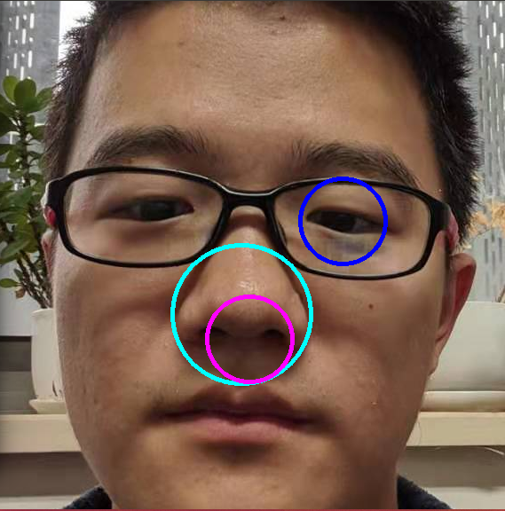
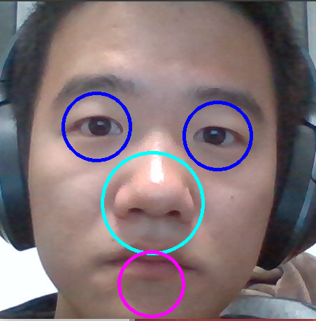
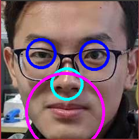

# FaceRecognition_OpenCV

This repository simply shows how to use OpenCV-3.4 to do an easy frontal face recognition.

`README.md`  is updated on 20191104 20:03:33.

---

Detection on a single face, also score the eyes, nose and mouth.

Using `cv::CascadeClassifier` to finished the main detection.

[Model 3.4](https://github.com/opencv/opencv/tree/3.4/data) for the OpenCV-3.4 model.

[Model 2.4](https://github.com/opencv/opencv/tree/2.4/data) for the OpenCV-2.4 model. 

1. Detect the eyes
2. Detect the nose below the eyes which are the closest to the mid cols of ROI (Region of Interest, here indicates the human face, which is a rectangle).
3. Detect the mouth below the nose which are closest to the mid cols of ROI.

But there are still some problems occurs.

## Dependencies 

- [OpenCV-3.4](https://github.com/opencv/opencv/tree/3.4) 
- [OpenCV-contrib](https://github.com/opencv/opencv_contrib/tree/3.4) 

- [Yaml-cpp](https://github.com/jbeder/yaml-cpp) 

The instructions on building these libs are pretty clear in their README.md.

## Bugs

1. As mentioned above, nose detection and mouth detection are depended on the result of eyes detection. So if there is something wrong with the eyes detection, the whole detection terminates. I put this part in the `TODO:` . I have not figured out how the handle it when we have 3 or more eyes detection only using OpenCV.
2. For the part of the nose and mouth detection, I choose the ones who are closest to the mid cols of the ROI. Here the situation is like, maybe some wrong detections (which is similar to the right one) are closest to the right one. 

For this one, only have one eye has been detected, with a wrong mouth detection.

Mouth is lower.

Good one, but the mouth is too big.
